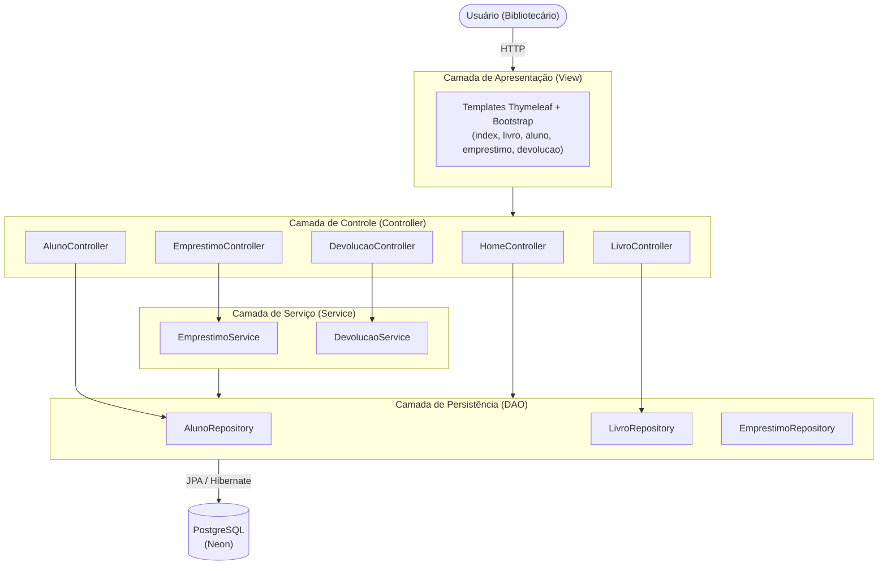

# Arquitetura do Sistema de Biblioteca

Este documento descreve a arquitetura do Sistema de Biblioteca, contemplando a visão
conceitual, a descrição dos elementos e suas dependências e os padrões arquiteturais
adotados.

## 1. Visão Conceitual da Arquitetura

O sistema segue uma **Arquitetura em Camadas**, na qual cada camada possui uma
responsabilidade única e se comunica apenas com a camada imediatamente inferior.
A representação de alto nível da estrutura do sistema é apresentada a seguir:

## 2. Descrição dos Elementos da Arquitetura e Dependências

### 2.1 Camada de Apresentação (View)

Interface gráfica do sistema, construída com templates **Thymeleaf** e estilizada com
**Bootstrap 5**. É responsável por capturar as interações do usuário e disparar
requisições HTTP para a camada de controle. Elementos que a compõem:

- `fragments/layout.html`: fragmentos reutilizáveis (menu lateral, alertas e head);
- `index.html`: visão geral do sistema com indicadores;
- `livro/lista.html` e `livro/novo.html`: consulta e cadastro de livros;
- `aluno/lista.html` e `aluno/novo.html`: consulta e cadastro de alunos;
- `emprestimo/novo.html`: realização de empréstimos;
- `devolucao/nova.html`: registro de devoluções.

**Dependências:** a View depende exclusivamente dos Controllers, por meio de
requisições HTTP (GET para exibição e POST para submissão de formulários) e dos
atributos recebidos via `Model`.

### 2.2 Camada de Controle (Controller)

Ponto de entrada das requisições HTTP. Recebe os dados da View, realiza validações
sintáticas básicas de entrada e delega a execução, retornando a resposta HTTP
correspondente (renderização de template ou redirecionamento). Elementos:

- `HomeController`: alimenta a visão geral com os indicadores do sistema;
- `LivroController` e `AlunoController`: consulta e cadastro das entidades;
- `EmprestimoController`: exibe o formulário de empréstimo e aciona o caso de uso;
- `DevolucaoController`: lista empréstimos ativos e aciona o caso de uso de devolução.

**Dependências:** os controllers dos casos de uso (`EmprestimoController` e
`DevolucaoController`) dependem da camada de Serviço. Os controllers de cadastro e
consulta (`LivroController`, `AlunoController` e `HomeController`), por realizarem
operações simples de CRUD sem regras de negócio complexas, acessam diretamente a
camada de persistência.

### 2.3 Camada de Serviço (Service)

Centraliza a lógica e as regras de negócio do sistema, orquestrando as regras do
domínio e garantindo a integridade das operações. Elementos:

- `EmprestimoService`: valida a existência do aluno, verifica débitos pendentes,
  confere a disponibilidade dos livros, calcula a data prevista de devolução (maior
  prazo entre os livros, com acréscimo de 2 dias por livro que exceder 2) e persiste
  o empréstimo;
- `DevolucaoService`: verifica se o empréstimo está ativo, registra a data efetiva
  de devolução, aplica débito ao aluno em caso de atraso e libera os livros.

**Dependências:** a camada de Serviço depende exclusivamente da camada de
Persistência (Repositories).

### 2.4 Camada de Persistência (DAO)

Camada isolada e especializada no acesso ao banco de dados, implementada com o
padrão **Data Access Object (DAO)** por meio de interfaces do **Spring Data JPA**:

- `AlunoRepository`: consultas por RA e operações de CRUD de `Aluno`;
- `LivroRepository`: consultas por ISBN e operações de CRUD de `Livro`;
- `EmprestimoRepository`: consultas por aluno e por status e operações de CRUD de
  `Emprestimo`.

**Dependências:** os Repositories dependem apenas das entidades do domínio (`Aluno`,
`Livro`, `Emprestimo`) e do provedor JPA (Hibernate), que realiza o mapeamento
objeto-relacional para o banco.

### 2.5 Banco de Dados

SGBD **PostgreSQL** hospedado na plataforma Neon, acessado via JDBC. O esquema é
gerado e atualizado pelo Hibernate a partir do mapeamento das entidades.

### 2.6 Fluxo de uma requisição (exemplo: Emprestar Livro)

1. O usuário preenche o formulário em `emprestimo/novo.html` e submete o POST
   `/emprestimos/novo` com o RA e os livros selecionados;
2. O `EmprestimoController` recebe a requisição e delega ao
   `EmprestimoService.emprestar(ra, livroIds)`;
3. O Service aplica as regras de negócio consultando `AlunoRepository`,
   `LivroRepository` e `EmprestimoRepository`, e persiste o empréstimo;
4. O resultado retorna ao Controller, que redireciona a View exibindo a mensagem de
   sucesso ou de erro.

## 3. Padrões Arquiteturais

A arquitetura foi baseada na combinação dos seguintes padrões:

- **Arquitetura em Camadas:** organiza o sistema em camadas com responsabilidades
  bem definidas (Apresentação, Controle, Serviço e Persistência), de forma que cada
  camada dependa apenas da inferior;
- **MVC (Model-View-Controller):** separa o modelo de domínio (entidades), a
  interface com o usuário (templates Thymeleaf) e o controle do fluxo das requisições
  (controllers Spring MVC);
- **Service Layer:** concentra as regras de negócio dos casos de uso Emprestar e
  Devolver em classes de serviço, mantendo os controllers responsáveis apenas pelo
  ciclo de vida do HTTP;
- **DAO (Data Access Object):** isola o acesso a dados em interfaces de repositório,
  desacoplando as regras de negócio da tecnologia de persistência.

### Justificativa da escolha

A introdução da Camada de Serviço faz com que os controladores fiquem responsáveis
apenas pelo ciclo de vida do HTTP, resultando em um código com alto desacoplamento e
alta coesão. Além disso, isolar as regras de negócio na Service Layer facilita a
escrita de testes unitários automatizados, permitindo que os cenários de teste
validem as lógicas de empréstimo e devolução sem a necessidade de simular requisições
HTTP ou renderizar interfaces gráficas (ver `docs/cenarios_de_teste.md`).

O padrão DAO, por sua vez, permite trocar a tecnologia de persistência com impacto
mínimo nas demais camadas, e o uso do Spring Data JPA reduz o código repetitivo de
acesso a dados, mantendo o contrato das operações explícito nas interfaces.
