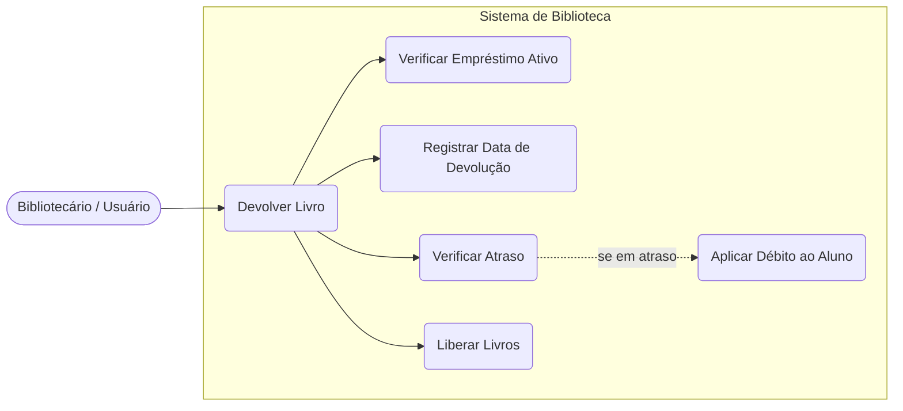

```mermaid
graph LR
    U([Bibliotecário / Usuário])

    subgraph Sistema de Biblioteca
        DL(Devolver Livro)
        VE(Verificar Empréstimo Ativo)
        RD(Registrar Data de Devolução)
        VA(Verificar Atraso)
        AD(Aplicar Débito ao Aluno)
        LL(Liberar Livros)
    end

    U --> DL
    DL --> VE
    DL --> RD
    DL --> VA
    VA -.->|se em atraso| AD
    DL --> LL
```
