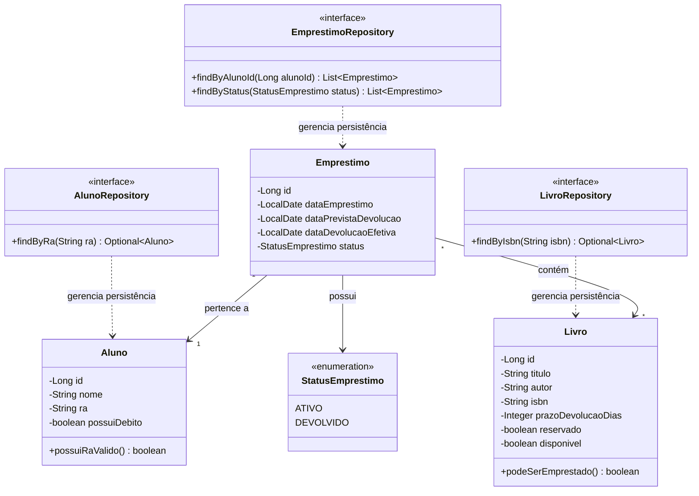

```mermaid
classDiagram
    class Aluno {
        -Long id
        -String nome
        -String ra
        -boolean possuiDebito
        +possuiRaValido() boolean
    }

    class Livro {
        -Long id
        -String titulo
        -String autor
        -String isbn
        -Integer prazoDevolucaoDias
        -boolean reservado
        -boolean disponivel
        +podeSerEmprestado() boolean
    }

    class Emprestimo {
        -Long id
        -LocalDate dataEmprestimo
        -LocalDate dataPrevistaDevolucao
        -LocalDate dataDevolucaoEfetiva
        -StatusEmprestimo status
    }

    class StatusEmprestimo {
        <<enumeration>>
        ATIVO
        DEVOLVIDO
    }

    class AlunoRepository {
        <<interface>>
        +findByRa(String ra) Optional~Aluno~
    }

    class LivroRepository {
        <<interface>>
        +findByIsbn(String isbn) Optional~Livro~
    }

    class EmprestimoRepository {
        <<interface>>
        +findByAlunoId(Long alunoId) List~Emprestimo~
        +findByStatus(StatusEmprestimo status) List~Emprestimo~
    }

    Emprestimo "1" --> "1" Aluno : pertence a
    Emprestimo "*" --> "*" Livro : contém
    Emprestimo --> StatusEmprestimo : possui

    AlunoRepository ..> Aluno : gerencia persistência
    LivroRepository ..> Livro : gerencia persistência
    EmprestimoRepository ..> Emprestimo : gerencia persistência
```
