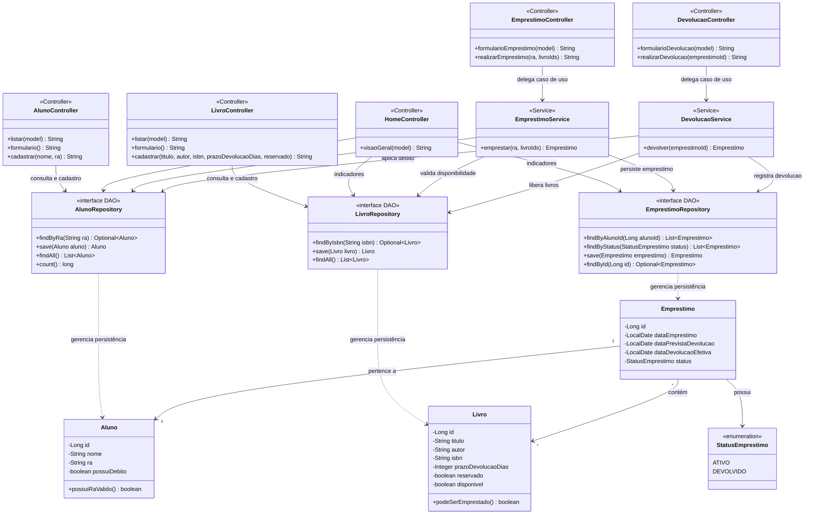

# Diagrama de Classes

Diagrama de classes do Sistema de Biblioteca atualizado com todas as camadas da
arquitetura: Controle (Controller), Serviço (Service), Persistência (DAO, padrão
Data Access Object via Spring Data JPA) e o modelo de domínio (entidades).

## Observações

- A camada de persistência aplica o padrão **DAO** por meio de interfaces do Spring
  Data JPA: cada Repository é o objeto de acesso a dados de uma entidade, expondo as
  operações de consulta e escrita e isolando as demais camadas da tecnologia de
  banco de dados.
- Os controllers dos casos de uso (Emprestar e Devolver) dependem apenas dos
  Services, que concentram as regras de negócio. Os controllers de cadastro e
  consulta acessam os Repositories diretamente por se tratarem de operações simples
  de CRUD.
- Os métodos `save`, `findAll`, `findById` e `count` são herdados de
  `JpaRepository` e foram representados nos DAOs por serem utilizados pelo sistema.
