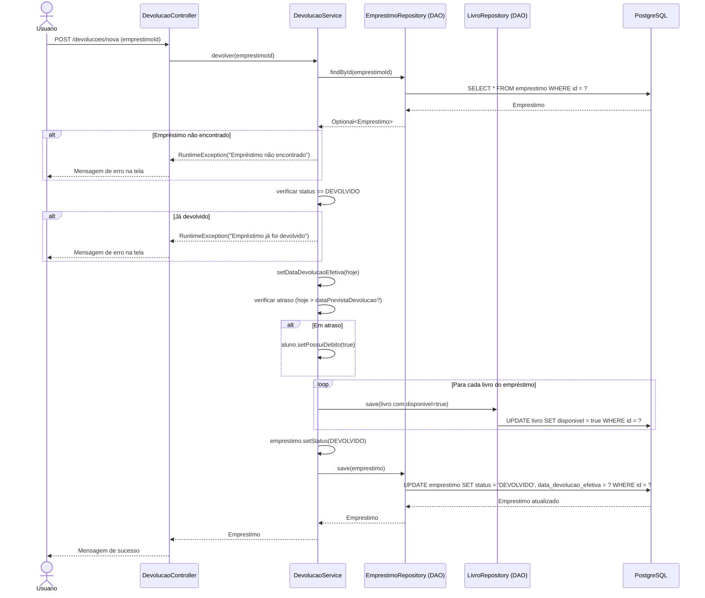

```mermaid
sequenceDiagram
    actor Usuario
    participant DC as DevolucaoController
    participant DS as DevolucaoService
    participant ER as EmprestimoRepository (DAO)
    participant LR as LivroRepository (DAO)
    participant DB as PostgreSQL

    Usuario->>DC: POST /devolucoes/nova (emprestimoId)
    DC->>DS: devolver(emprestimoId)

    DS->>ER: findById(emprestimoId)
    ER->>DB: SELECT * FROM emprestimo WHERE id = ?
    DB-->>ER: Emprestimo
    ER-->>DS: Optional<Emprestimo>

    alt Empréstimo não encontrado
        DS-->>DC: RuntimeException("Empréstimo não encontrado")
        DC-->>Usuario: Mensagem de erro na tela
    end

    DS->>DS: verificar status == DEVOLVIDO
    alt Já devolvido
        DS-->>DC: RuntimeException("Empréstimo já foi devolvido")
        DC-->>Usuario: Mensagem de erro na tela
    end

    DS->>DS: setDataDevolucaoEfetiva(hoje)

    DS->>DS: verificar atraso (hoje > dataPrevistaDevolucao?)
    alt Em atraso
        DS->>DS: aluno.setPossuiDebito(true)
    end

    loop Para cada livro do empréstimo
        DS->>LR: save(livro com disponivel=true)
        LR->>DB: UPDATE livro SET disponivel = true WHERE id = ?
    end

    DS->>DS: emprestimo.setStatus(DEVOLVIDO)
    DS->>ER: save(emprestimo)
    ER->>DB: UPDATE emprestimo SET status = 'DEVOLVIDO', data_devolucao_efetiva = ? WHERE id = ?
    DB-->>ER: Emprestimo atualizado
    ER-->>DS: Emprestimo

    DS-->>DC: Emprestimo
    DC-->>Usuario: Mensagem de sucesso
```
