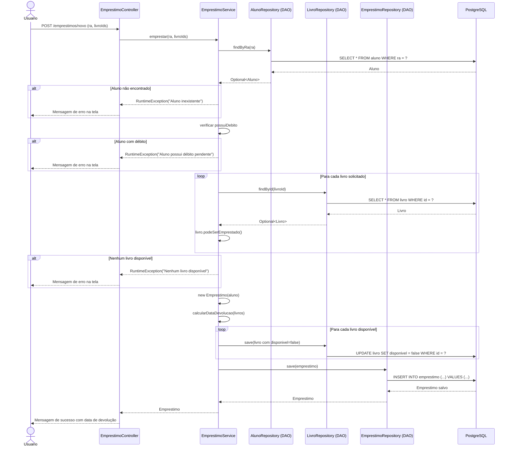

```mermaid
sequenceDiagram
    actor Usuario
    participant EC as EmprestimoController
    participant ES as EmprestimoService
    participant AR as AlunoRepository (DAO)
    participant LR as LivroRepository (DAO)
    participant ER as EmprestimoRepository (DAO)
    participant DB as PostgreSQL

    Usuario->>EC: POST /emprestimos/novo (ra, livroIds)
    EC->>ES: emprestar(ra, livroIds)

    ES->>AR: findByRa(ra)
    AR->>DB: SELECT * FROM aluno WHERE ra = ?
    DB-->>AR: Aluno
    AR-->>ES: Optional<Aluno>

    alt Aluno não encontrado
        ES-->>EC: RuntimeException("Aluno inexistente")
        EC-->>Usuario: Mensagem de erro na tela
    end

    ES->>ES: verificar possuiDebito
    alt Aluno com débito
        ES-->>EC: RuntimeException("Aluno possui débito pendente")
        EC-->>Usuario: Mensagem de erro na tela
    end

    loop Para cada livro solicitado
        ES->>LR: findById(livroId)
        LR->>DB: SELECT * FROM livro WHERE id = ?
        DB-->>LR: Livro
        LR-->>ES: Optional<Livro>
        ES->>ES: livro.podeSerEmprestado()
    end

    alt Nenhum livro disponível
        ES-->>EC: RuntimeException("Nenhum livro disponível")
        EC-->>Usuario: Mensagem de erro na tela
    end

    ES->>ES: new Emprestimo(aluno)
    ES->>ES: calcularDataDevolucao(livros)

    loop Para cada livro disponível
        ES->>LR: save(livro com disponivel=false)
        LR->>DB: UPDATE livro SET disponivel = false WHERE id = ?
    end

    ES->>ER: save(emprestimo)
    ER->>DB: INSERT INTO emprestimo (...) VALUES (...)
    DB-->>ER: Emprestimo salvo
    ER-->>ES: Emprestimo

    ES-->>EC: Emprestimo
    EC-->>Usuario: Mensagem de sucesso com data de devolução
```
